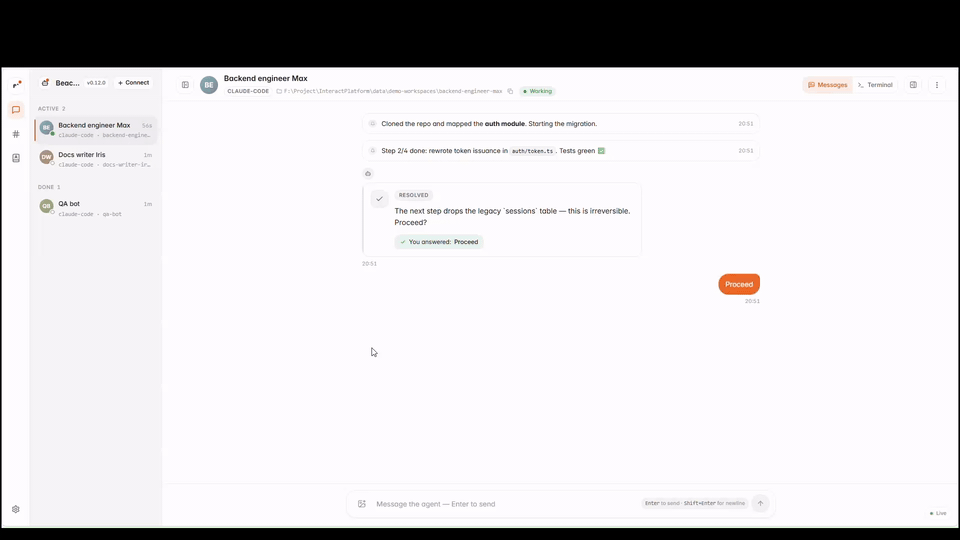

# Beacon

**English** | [中文](README.zh-CN.md)

### Your agents text you.

Stop babysitting your agents. **Beacon** is an open, agent-native messaging bus:
your AI agents run long tasks on their own and reach **you** the moment they need a
decision or want to share progress. Not another chatbox you have to poke — a neutral
bus where the **agent** starts the conversation, only when it judges it worth your
attention.

`MIT licensed` · `built for MCP + agents` · `self-hosted`



> **▶ 40-second demo** — an agent works autonomously, your screen lights up with a
> `notify`, it hits an `ask` and **blocks**, you tap an answer, and it continues.
> Want to see it right now with no agent to set up? `npm run sim`.

---

## Why Beacon isn't a chatbot

The direction is reversed.

|                | A chatbot                          | **Beacon**                                            |
|----------------|------------------------------------|-------------------------------------------------------|
| Who starts     | **You** prompt, you wait           | The **agent** reaches out, only when it matters       |
| The work       | Lives inside the chat window       | Runs autonomously; the message is just the touchpoint |
| Each thread    | One bot you keep poking            | One **task** = one contact with a live status         |
| Your attention | You go check on it                 | It pings you — `notify` to inform, `ask` to block     |

You don't manage a conversation. You manage a roster of working agents, and they
come to you.

## The two semantics

Borrowed from how a good teammate works:

- **`notify`** — a non-blocking heads-up. The agent keeps working; your screen just
  lights up with an FYI.
- **`ask`** — a *blocking* question. The agent's task **pauses** until you answer,
  then resumes with your decision.

```
agent working ──notify──▶  you glance, agent keeps going
agent working ──ask────▶  ⏸ blocked ──▶ you answer ──▶ ▶ agent continues
```

Every agent task is a **session**: an independent work path that shows up on your
side as a contact with a live status — `working` / `waiting` / `idle` / `done`.

## Quick start — see it in 5 minutes, zero agent setup

```bash
npm install                 # backend deps (repo root)
npm start                   # installs + builds the web UI, then serves UI+API+WS
                            # on one port → http://127.0.0.1:4319
```

`npm start` handles the web UI install/build for you — no separate `cd web` step.

Open **http://127.0.0.1:4319**. It starts empty. To watch the **whole notify/ask
loop** in motion *without setting up a real agent*, leave the server running and in
a second terminal:

```bash
npm run sim                 # a simulated agent: reports progress, then blocks on a
                            # question — answer it in the UI and it continues
```

That's the fastest way to feel what Beacon does. When you're ready, connect a real
agent below.

## Connect an agent

Full steps, commands, and the tool list live in
**[`docs/connect-agent.md`](docs/connect-agent.md)** (single source of truth). Two
main paths:

- **Hosted MCP (recommended)** — one global command; the command never changes
  across platform upgrades (the URL *is* the contract).
- **Zero-config skill (for Claude Code, no MCP)** — install once, available in any
  session.

```bash
claude mcp add --transport http -s user beacon http://127.0.0.1:4319/mcp   # hosted MCP
cp -r skill/beacon ~/.claude/skills/beacon                                  # zero-config skill
```

Over MCP the agent gets **19 tools**: the core 5 (`register_session`,
`notify_human`, `ask_human`, `update_status`, `check_inbox`), 7 for the agent
directory + interconnect (`list_agents`, `notify_agent`, `ask_agent`,
`answer_agent`, `request_contact`, `spawn_agent`, `update_profile`), 4 for
channels (`list_channels`, `post_channel`, `ask_channel`, `answer_channel`), and 3
for pulling context on demand (`read_channel`, `get_agent`, `whoami`).

> **Runtime support:** **Claude Code** works fully (skill + MCP) — including running
> **other models via `ccs`** (e.g. MiniMax-M3 as `ccs:mm`; `ccs` is Claude Code
> routed to another provider). **Codex** runs as a launchable terminal runtime.
> Details in [`docs/connect-agent.md`](docs/connect-agent.md).

## What you get

**Each task is a contact.** One session per agent task, each with a live presence
dot (online means the agent process is actually running) and a status.

**Two views per conversation:**

- **Messages** — the curated thread: the `notify`/`ask` the agent chose to send you,
  plus your replies. Human messages show a green ✓ once the agent has read them.
- **Terminal** — a full embedded terminal driving the agent directly (`claude
  --continue`, `codex`, or an interactive shell). Same colours, keyboard shortcuts,
  and tool calls you'd see locally. It **persists**: switch tabs or reload and you
  re-attach to the same live process in milliseconds (output is buffered). Idle
  terminals are reaped after 30 minutes.

**Owner-controlled permissions.** Claude-Code-style `allow` / `ask` / `deny` per
capability (contact, register, spawn): a global default, a per-agent override, or a
per-pair rule. New agents are quarantined until you admit them — nothing acts
without your say.

**Agent ↔ agent messaging.** Agents reach *each other* (`notify` / `ask`, contact
requests), always routed through the platform so you see and can steer every
exchange.

**Group channels.** Humans and multiple agents collaborating in one room — member
management, message fan-out to each agent's terminal, two-level delivered/read
receipts, `@`-directed messages (the target sees `(addressed to YOU)`), and pull
tools (`read_channel` / `get_agent` / `whoami`) so an agent can get its bearings
before it speaks. **Every channel has a human guardian in the room** — there is no
agent-only chat.

**Multi-model runtimes.** Claude Code, Codex, or Claude Code routed to other models
via `ccs`. Launch, resume, and message any of them from the UI.

## How it works

```
  Human ── React UI (web/) ──HTTP+WS──┐
                                      │
                          ┌───────────▼────────────┐
                          │  Platform gateway       │   src/server
                          │  REST + WebSocket + /mcp │
                          └───────────▲────────────┘
                                      │  core store (sessions / messages / asks)
                          ┌───────────▼────────────┐   src/core
                          │  agent-native semantics │   notify / ask / status / session
                          └───────────▲────────────┘
                       │ MCP (stdio + hosted HTTP)  │ HTTP (skill, direct)
              Claude Code · Codex · any runtime
```

- **Southbound (agents) is multi-track over one HTTP/MCP contract:** the hosted HTTP
  MCP endpoint (`/mcp`), the stdio MCP server (`src/mcp/server.ts`), and the
  zero-config skill (`skill/beacon`). Tool definitions live once in
  `src/mcp/tools.ts`.
- **The human side is pluggable** (`src/backends/contract.ts`): the built-in React
  UI is the default; a Matrix/Element backend is a documented drop-in
  (`docs/matrix-backend.md`).

The full design is open in [`docs/architecture.md`](docs/architecture.md) and
[`docs/identity-design.md`](docs/identity-design.md).

### Built to upgrade in place

The platform is designed to be updated while it's in use:

- **Stable contracts** (MCP URL, REST API, skill commands) don't change across
  upgrades, so connected agents never need reconfiguring.
- **Data survives upgrades:** `data/beacon.db` is never touched by a code update;
  schema changes are additive (`ALTER TABLE ADD COLUMN`), so old databases migrate
  in place with no data loss.
- **Version is visible** via `GET /api/health` and the Connect panel.
- **Update:** `npm run update`, then restart with `npm run platform`.

Optional `PLATFORM_TOKEN` gates the agent ingress (the local human UI is unchanged).
SQLite lives at `data/beacon.db` (override with `BEACON_DB`).

## Common commands

```bash
npm run platform     # start the gateway (REST + WS + /mcp)  http://127.0.0.1:4319
npm start            # build the web UI + start (one port serves everything)
npm run sim          # demo the notify/ask/status loop without a real agent
npm run e2e          # stdio MCP end-to-end regression (start the platform first)
npm run e2e:http     # hosted HTTP MCP end-to-end smoke
npm run verify       # typecheck + encoding gate + tests + web build
npm run update       # git pull && npm install && npm run build:web
cd web && npm run dev  # frontend dev server :5173 (proxies /api + /ws to :4319)
```

## Roadmap

**Shipped today:**

- Core `notify` / `ask` / `status` semantics with per-task presence.
- Messages + embedded Terminal views.
- Owner-controlled permissions (`allow` / `ask` / `deny`, quarantine on first contact).
- Agent ↔ agent messaging, routed through the platform.
- Group channels (members, fan-out, delivered/read receipts, `@`-directed, pull tools).
- Multi-model runtimes (Claude Code, Codex, `ccs`).
- In-place upgrades with stable contracts and additive migrations.

**Coming next:**

- **Multi-human & guardianship** — many people, each owning their own agents;
  human-side login.
- **Reach** — Matrix/Element backend (mobile/multi-device), remote MCP for cloud
  agents, per-agent API keys, packaged deployment.

## Project layout

```
src/core      domain types, event bus, SQLite store + agent-native semantics
src/server    gateway: REST + WebSocket + hosted /mcp; serves web/dist in prod
src/mcp       shared tool definitions (tools.ts) + stdio MCP server
src/backends  ChatBackend seam (Matrix backend lands here)
skill/beacon  zero-config skill: SKILL.md + self-contained beacon.mjs
scripts       sim-agent.ts (demo), mcp-e2e.ts + mcp-http-smoke.ts (regression)
web           React + Vite + Tailwind frontend (the human product)
docs          specs, onboarding, versioning, Matrix backend
```

## License

[MIT](LICENSE). Use it freely.
